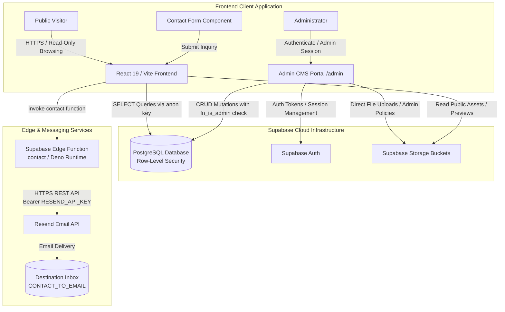
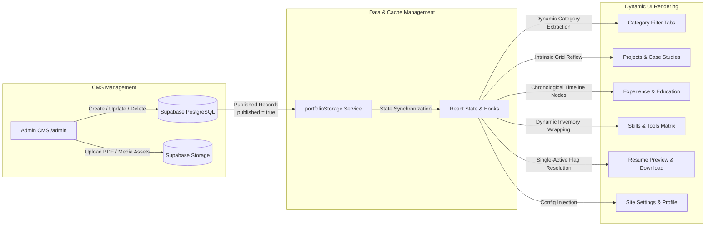
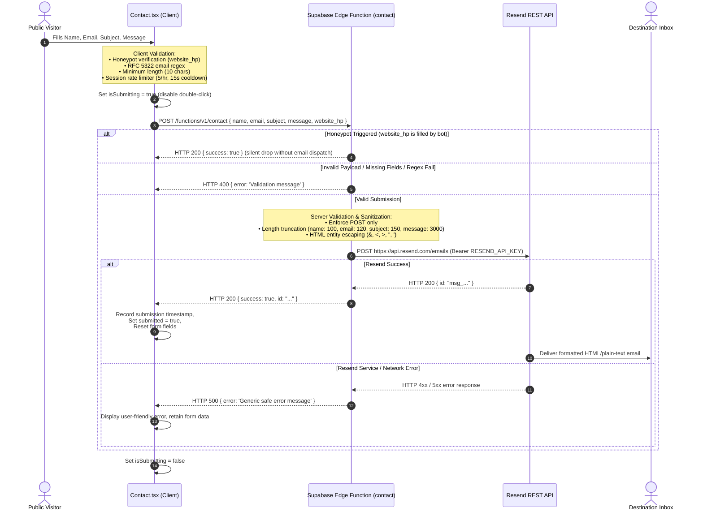

# Cybersecurity & Software Engineering Portfolio Platform

A database-backed, content-driven portfolio web application and content management system engineered with React 19, TypeScript, Tailwind CSS, and Supabase. The platform establishes a strict architectural decoupling between structured professional records and responsive UI presentation, enabling administrative content lifecycle management without requiring frontend code modifications or layout refactoring.

---

## Overview

This project serves as a dynamic, content-driven portfolio and technical administration platform. Unlike static markdown-based portfolios, this system treats all portfolio data—including engineering projects, interactive case studies, career timelines, academic credentials, verified certifications, skill inventories, and resume documents—as structured relational entities backed by a Supabase PostgreSQL database.

The user interface automatically derives categories, recomputes grid geometries, handles optional metadata, and reflows across viewports dynamically as records are added, updated, or removed through the protected administrative interface.

---

## Why This Project?

This portfolio was intentionally engineered as a production application rather than a static personal website.

It demonstrates practical implementation of:

- Secure application architecture
- Role-based administrative access
- PostgreSQL Row Level Security
- Secure file handling
- Server-side secret isolation
- Serverless API integration
- Responsive, content-driven UI architecture
- Production deployment and validation

---

## Key Features

- **Dynamic Content Flow**: Public sections render iteratively from structured database collections and automatically reflect published administrative updates.
- **Projects & Technical Case Studies**: Interactive project cards featuring status tags, applied technology badges, architecture workflows, live/repository links, and deep-dive case study modal dialogs.
- **Search & Dynamic Category Filtering**: Client-side text search across titles, technologies, and descriptions, paired with category tabs derived dynamically from active database records.
- **Categorized Skills Matrix**: Grouped technical tool, language, and framework inventories with intrinsic flex wrapping.
- **Experience Timeline**: Chronological career and role milestone timeline detailing responsibilities, methodologies, and applied technologies.
- **Academic Milestones**: Education history timeline featuring degrees, institutions, academic periods, grades/scores, and specialized coursework modules.
- **Verified Certifications**: Credential cards with issuer metadata, dates, external credential verification links, and interactive credential preview/download modals.
- **Resume Document Management**: Public resume preview and download interface driven by an administrative single-active-document publishing workflow.
- **Administrative CMS (`/admin`)**: Password-authenticated administrative portal for managing projects, certifications, experience, education, skills, resumes, and site settings.
- **Secure Serverless Contact Flow**: Asynchronous contact submission routed through a Supabase Edge Function to Resend's REST API with honeypot spam protection, dual-tier validation, and complete API key isolation.

---

## High-Level System Architecture



---

## Dynamic Content Architecture

The public interface is designed around content-driven adaptability. All portfolio sections render dynamically from structured data models, preventing UI degradation or breaking layout boundaries when content volume changes.



### Content Scalability Principles

- **Dynamic Category Derivation**: Project filter tabs are computed dynamically using unique category values present in active records rather than hardcoded lists.
- **Intrinsic Grid Scaling**: Grid containers (`grid-cols-1 md:grid-cols-2 lg:grid-cols-3`) naturally add rows as records increase.
- **Flexible Card Layouts**: Cards utilize intrinsic sizing without fixed vertical constraints, preventing text truncation or container collisions.
- **Graceful Degradation**: Optional fields (such as repository links, demo URLs, credential IDs, or specialized coursework) omit corresponding sub-elements without rendering blank gaps.
- **Contextual Empty States**: Every collection view incorporates a fallback state when no published records match an active filter or search query.
- **Bounded Animation Staggering**: Viewport entrance animations cap stagger delays (`Math.min(index * delay, maxDelay)`), ensuring fast visual readiness regardless of list length.

---

## Secure Contact & Email Architecture

The contact submission system dispatches inquiries to a Supabase Edge Function that communicates directly with Resend's HTTPS REST API. The `RESEND_API_KEY` remains strictly in server-side secret storage and is never bundled or exposed to the client.



---

## Security Architecture

The application implements defense-in-depth across database access, serverless processing, storage operations, and client interaction.

### 1. Database Security & Row Level Security (RLS)
- **RLS Enabled on All Tables**: Enforced across `projects`, `experience`, `certifications`, `education`, `skills`, `security_practices`, `resumes`, `site_settings`, and `admin_users`.
- **Public Privilege Minimization**: The `anon` role is granted `SELECT` privileges only on published portfolio records (`published = true`). Unneeded operations (`INSERT`, `UPDATE`, `DELETE`, `TRUNCATE`, `REFERENCES`, `TRIGGER`) are revoked from `anon`.
- **Zero Access to Admin Users Table**: The `admin_users` table is completely inaccessible to `anon`.
- **Authenticated Role Authorization**: Mutations are permitted only when `fn_is_admin()` evaluates to `true` against the authenticated user's ID (`auth.uid()`).
- **Function Hardening**: `fn_is_admin()` and `set_published_resume()` are declared with `SECURITY DEFINER` and hardcoded search paths (`SET search_path = public, auth, pg_temp`) to mitigate search-path hijacking.

### 2. Storage & File Security
- **Storage RLS Policies**: Public users retain read-only access to storage buckets (`projects`, `certificates`, `resumes`, `profile`). Write operations (`INSERT`, `UPDATE`, `DELETE`) require `admin_users` verification.
- **Binary Magic-Byte Inspection**: `detectFileSignature()` verifies actual file header bytes (PDF `%PDF-`, PNG `\x89PNG`, JPEG `\xFF\xD8\xFF`, WEBP `RIFF....WEBP`, GIF `GIF87a/89a`) using `File.slice()`, rejecting renamed executable or malicious binaries.
- **Filename Sanitization**: `sanitizeStorageFileName()` strips path traversal sequences (`..`, `/`, `\`) and non-alphanumeric characters.
- **Size Bounds**: Maximum limits enforced on uploads (10 MB for documents, 5 MB for images).

### 3. Serverless & API Key Isolation
- **Server-Side Secret Storage**: `RESEND_API_KEY` exists exclusively as a Supabase Edge Function secret. It is not declared in frontend environment variables or client bundles.
- **Zero Service-Role Leakage**: The client uses only the publishable anonymous key (`VITE_SUPABASE_ANON_KEY`).
- **HTML Escaping**: Contact form inputs are converted to safe HTML entities prior to email template rendering to prevent email client markup injection.

### 4. Client-Side Defensive Controls
- **Safe Protocol Filtering**: `sanitizeUrl()` restricts links, media, and iframes to `http:`, `https:`, `mailto:`, and `tel:`, stripping `javascript:`, `data:`, `vbscript:`, `blob:`, and `file:` vectors.
- **External Link Hardening**: External anchor tags specify `rel="noopener noreferrer"`.
- **No Dangerous DOM Injection**: Avoids `dangerouslySetInnerHTML` across all components; data is rendered safely as React children.
- **Client Rate Throttling**: Session-based throttling limits contact submissions to 5 per hour with a 15-second minimum interval between attempts.

---

## Responsive Design & Content Scalability

The interface adapts across mobile, tablet, desktop, and wide displays:

- **Mobile Viewports (< 768px)**: Single-column layouts, 44px minimum touch targets, full-width modal views, and an animated navigation drawer.
- **Tablet Viewports (768px – 1024px)**: Two-column grid reflows, adjusted timeline spacing, and responsive card arrangements.
- **Desktop Viewports (> 1024px)**: Multi-column grid distribution, expanded timeline nodes, and side-by-side technical specification panels.
- **Ultra-Wide Screens (> 1440px)**: Centered containers (`max-w-6xl`, `max-w-7xl`) maintain optimal line lengths (`65–75ch`).

---

## Accessibility

- **Keyboard Navigation**: Document flow with logical tab indexing, distinct `:focus-visible` outline rings, and global `Escape` key listeners for modal dismissal.
- **Semantic HTML**: Structural hierarchy using `<header>`, `<nav>`, `<main>`, `<section>`, `<article>`, `<aside>`, and `<button>`.
- **Contrast & Legibility**: High-contrast text pairings designed for readability across the dark interface.
- **Reduced Motion Support**: Animations respect system `prefers-reduced-motion: reduce` settings.

---

## Performance & Build Metrics

The application utilizes route-level and component-level code splitting via `React.lazy()` and Vite manual chunk configuration. Administrative management modules and modal dialogs load on demand, keeping the critical entry bundle lightweight.

### Production Bundle Composition

| Chunk | Size | Gzip Size | Type |
| :--- | :--- | :--- | :--- |
| `dist/index.html` | 2.01 kB | 0.80 kB | HTML Document |
| `dist/assets/index.css` | 49.05 kB | 8.73 kB | Stylesheet |
| `dist/assets/index.js` | 166.81 kB | 29.22 kB | Application Entry |
| `dist/assets/vendor-react.js` | 396.57 kB | 118.76 kB | Core Runtime |
| `dist/assets/vendor-supabase.js` | 219.90 kB | 57.42 kB | Supabase Client SDK |
| `dist/assets/vendor-motion.js` | 131.37 kB | 43.68 kB | Animation Engine |
| `dist/assets/vendor-lucide.js` | 23.28 kB | 5.06 kB | Icon Components |
| `dist/assets/AdminLayout.js` | 20.37 kB | 3.53 kB | Lazy Loaded (Admin) |
| `dist/assets/AdminDashboardView.js` | 34.55 kB | 3.22 kB | Lazy Loaded (Admin) |
| `dist/assets/ProjectsManager.js` | 27.43 kB | 3.77 kB | Lazy Loaded (Admin) |
| `dist/assets/ResumeManager.js` | 33.81 kB | 5.67 kB | Lazy Loaded (Admin) |
| `dist/assets/CertificationsManager.js` | 19.49 kB | 3.09 kB | Lazy Loaded (Admin) |
| `dist/assets/SkillsManager.js` | 17.47 kB | 3.27 kB | Lazy Loaded (Admin) |
| `dist/assets/CaseStudyModal.js` | 11.09 kB | 2.05 kB | Lazy Loaded (Modal) |
| `dist/assets/ResumeModal.js` | 13.99 kB | 3.20 kB | Lazy Loaded (Modal) |
| `dist/assets/CertificateModal.js` | 17.74 kB | 3.49 kB | Lazy Loaded (Modal) |

---

## Technology Stack

| Technology | Purpose |
| :--- | :--- |
| **React 19** | Component-based UI rendering, custom hooks, and state management |
| **TypeScript 5.8** | Static type checking and strict data modeling |
| **Vite 6** | Build system, asset bundling, and local development server |
| **Tailwind CSS 4** | Utility-first CSS layout engine and responsive styling |
| **Motion 12** | Viewport animations, modal transitions, and interactive motion |
| **Supabase Database** | Managed PostgreSQL database with Row Level Security (RLS) |
| **Supabase Auth** | Administrative session and JWT authentication |
| **Supabase Storage** | Object storage buckets for resumes, certificates, and media assets |
| **Supabase Edge Functions** | Deno-based serverless execution runtime for contact form handling |
| **Resend REST API** | HTTPS email delivery service |
| **Lucide React** | Scalable vector interface icons |

---

## Project Structure

```
.
├── .env.example                     # Environment configuration template
├── .gitignore                       # Git ignore rules
├── index.html                       # Application HTML entry point
├── package.json                     # Dependencies and scripts
├── tsconfig.json                    # TypeScript compiler configuration
├── vite.config.ts                   # Vite build and bundle configuration
├── supabase/
│   ├── functions/
│   │   └── contact/
│   │       └── index.ts             # Contact form Supabase Edge Function (Deno)
│   └── migrations/
│       ├── 000_combined_portfolio_setup.sql  # Combined schema & RLS setup
│       ├── 001_initial_schema.sql            # Table definitions & JSONB structures
│       ├── 002_rls_policies.sql              # RLS policies & permission grants
│       ├── 003_seed_data.sql                 # Baseline portfolio records
│       └── 004_storage_buckets.sql           # Storage bucket configuration & policies
└── src/
    ├── main.tsx                     # React root mount entry point
    ├── App.tsx                      # Root component, routing, and modal coordination
    ├── index.css                    # Tailwind CSS imports and base styles
    ├── types.ts                     # TypeScript data model interfaces
    ├── data.ts                      # Offline fallback data store
    ├── lib/
    │   └── supabase.ts              # Supabase client initialization
    ├── utils/
    │   └── security.ts              # Security, magic-byte, and sanitization utilities
    ├── services/
    │   └── portfolioStorage.ts      # Data access layer, cache, and validation service
    └── components/
        ├── Navbar.tsx               # Navigation bar with mobile drawer
        ├── Hero.tsx                 # Profile introduction and CTA buttons
        ├── Projects.tsx             # Project grid and category filtering
        ├── Skills.tsx               # Grouped skill inventory matrix
        ├── Experience.tsx           # Career timeline section
        ├── Education.tsx            # Academic milestone timeline
        ├── Certifications.tsx       # Credential cards section
        ├── SecurityPractices.tsx    # Engineering security practices overview
        ├── ResumeSection.tsx        # Public resume preview and download section
        ├── Contact.tsx              # Asynchronous contact submission form
        ├── Footer.tsx               # Footer with metadata and navigation links
        ├── CaseStudyModal.tsx       # Deep-dive project case study dialog
        ├── CertificateModal.tsx     # Credential preview dialog
        ├── ResumeModal.tsx          # Resume viewer modal
        └── admin/                   # Administrative CMS components and editors
```

---

## Database & Backend Architecture

### Relational Schema
- **`site_settings`**: Global profile settings, contact endpoints, professional summary, and avatar references.
- **`projects`**: Project records, category designations, architecture workflows, applied technologies, and JSONB case study data.
- **`skills`**: Skill domains and categorized tool/technology arrays.
- **`experience`**: Professional roles, organizations, date ranges, responsibilities, and methodologies.
- **`education`**: Academic degrees, institutions, periods, scores, and coursework arrays.
- **`certifications`**: Professional credentials, issuing bodies, verification URLs, and credential file references.
- **`security_practices`**: High-level engineering and security focus areas.
- **`resumes`**: Resume document entries, targeted role types, and single-active publication flags.
- **`admin_users`**: Authorized administrative user IDs linked to Supabase Auth.

### Storage Buckets
- **`projects`**: Project screenshots, architectural diagrams, and media.
- **`certificates`**: Credential verification documents (PDF, PNG, JPEG).
- **`resumes`**: Uploaded resume PDF documents.
- **`profile`**: Profile avatars and header assets.

---

## Local Development

### Prerequisites
- **Node.js**: v18.0.0 or higher
- **npm**: v9.0.0 or higher

### Installation & Setup

1. **Clone the repository**:
   ```bash
   git clone https://github.com/Avalar06/ayush-dutta-portfolio.git
   cd ayush-dutta-portfolio
   ```

2. **Install dependencies**:
   ```bash
   npm install
   ```

3. **Configure environment variables**:
   ```bash
   cp .env.example .env
   ```

4. **Start local development server**:
   ```bash
   npm run dev
   ```
   The application runs on `http://localhost:3000`.

### Available Scripts

- `npm run dev`: Starts the Vite development server.
- `npm run lint`: Executes TypeScript type checking across the project (`tsc --noEmit`).
- `npm run build`: Compiles and bundles production assets into `dist/`.
- `npm run preview`: Serves the production build locally for verification.

---

## Environment Configuration

Create a `.env` file in the root directory following `.env.example`:

```env
# Supabase Client Configuration (Frontend)
VITE_SUPABASE_URL=https://your-project-id.supabase.co
VITE_SUPABASE_ANON_KEY=your-supabase-anon-key
```

### Supabase Edge Function Secrets

Edge Function secrets are managed server-side via the Supabase CLI or Dashboard and must **not** be included in `.env` or prefixed with `VITE_`:

```bash
supabase secrets set RESEND_API_KEY=re_your_resend_api_key
supabase secrets set CONTACT_TO_EMAIL=your-inbox-email@example.com
supabase secrets set RESEND_FROM_EMAIL="Portfolio Contact <onboarding@resend.dev>"
```

---

## Deployment

### Production Deployment

The frontend is deployed on Vercel and automatically redeployed when changes are pushed to the `main` branch.

```text
Local Development
      ↓
Git Commit
      ↓
GitHub / main
      ↓
Vercel Build
      ↓
Production Deployment
```

Ensure Vercel is configured with SPA rewrite routing in `vercel.json` (or Project Settings) to support direct path navigation on routes like `/admin` and `/reset-password`:

```json
{
  "rewrites": [{ "source": "/(.*)", "destination": "/index.html" }]
}
```

### Supabase Edge Function Deployment

Deploy the contact Edge Function without requiring client JWT verification (the function internally enforces CORS, validation, and honeypot protection):

```bash
supabase functions deploy contact --no-verify-jwt
```

---

## Verification & Validation

| Verification Check | Tool / Method | Result | Status |
| :--- | :--- | :--- | :--- |
| **TypeScript Compilation** | `npx tsc --noEmit --pretty false` | 0 errors | `PASS` |
| **Code Linting** | `npm run lint` | Clean pass | `PASS` |
| **Production Build** | `npm run build` | Assets generated in `dist/` in ~6s | `PASS` |
| **Secret Leakage Audit** | Regex inspection across `dist/` | 0 occurrences of private keys or service_role | `PASS` |
| **Database RLS Policies** | Supabase Migration Validation | RLS enforced on all 9 tables | `PASS` |
| **Storage Policies** | Supabase Storage Auditing | Public read, admin-only mutation | `PASS` |
| **Edge Function Syntax** | Deno runtime validation | Clean syntax and error handling | `PASS` |
| **Responsive Layouts** | Viewport testing (320px – 1920px) | Complete structural adaptation | `PASS` |

---

## Design Principles

- **Separation of Content and Presentation**: Data schema modifications and content updates do not dictate frontend layout restructuring.
- **Defense-in-Depth**: Security validation is applied at both client-side entry points and backend/database authorization boundaries.
- **Fail-Safe Offline Operation**: When database connections are unavailable, the application falls back gracefully to cached baseline data without throwing uncaught exceptions.
- **Typographic & Visual Clarity**: High-contrast, clean visual hierarchy with deliberate spacing, semantic colors, and disciplined negative space.

---

## Future Improvements

- **End-to-End Test Suite**: Integration of Playwright or Cypress for automated cross-browser testing.
- **Automated Backup Workflows**: Scheduled automated PostgreSQL database backups and storage export routines.
- **Content Version History**: Audit logging for administrative content changes and draft versioning.

---

## Author

**Ayush Dutta**  
Cybersecurity & Software Engineering Professional  

- **Live Portfolio:** [https://ayush-dutta-portfolio.vercel.app/](https://ayush-dutta-portfolio.vercel.app/)
- **Source Repository:** [https://github.com/Avalar06/ayush-dutta-portfolio](https://github.com/Avalar06/ayush-dutta-portfolio)
